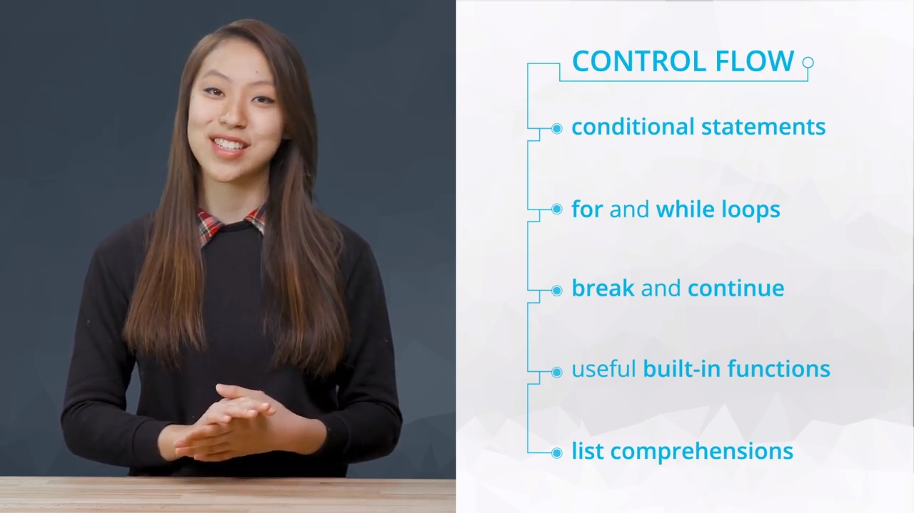

# Control Flow

<details><summary>Outline</summary>

<Dropdown Content>

- [Control Flow](#control-flow)
  - [L4-1. Introduction](#l4-1-introduction)
  - [L4-2. Conditional Statements](#l4-2-conditional-statements)
    - [if](#if)
    - [if...else...](#ifelse)
    - [elif](#elif)
    - [`=` vs. `==`](#vs)
    - [Indentation](#indentation)
      - [Spaces or Tabs?](#spaces-or-tabs)
  - [L4-7. Boolean Expressions for Conditions](#l4-7-boolean-expressions-for-conditions)
    - [Complex Boolean Expressions](#complex-boolean-expressions)
    - [Good and Bad Examples](#good-and-bad-examples)
      - [1. Don't use True or False as conditions](#1-dont-use-true-or-false-as-conditions)
      - [2. Be careful writing expressions that use logical operators](#2-be-careful-writing-expressions-that-use-logical-operators)
      - [3. Don't compare a boolean variable with == True or == False](#3-dont-compare-a-boolean-variable-with--true-or--false)
    - [Truth Value Testing](#truth-value-testing)
  - [Vocabulary](#vocabulary)

</details>

---

## L4-1. Introduction



- Control flow: the sequence in which your code is run.
- we'll learn about several tools in Python:
  - Conditional Statements
  - Boolean Expressions
  - For and While Loops
  - Break and Continue
  - Zip and Enumerate
  - List Comprehensions

## L4-2. Conditional Statements

### if


### if...else...


### elif


- if we have more than two possible cases, we can use eilf
- `elif` short for `else if`

### `=` vs. `==`


- `=`: assign operator
- `==`: comparison operator

### Indentation

- Unlike other programming language using braces to enclose block of code
- In python, we use indentation to enclose block of code.
- This indentation conventionally comes in multiples of four spaces.
- It's important to be strict about following this convention.

#### Spaces or Tabs?

- The [Python Style Guide](https://www.python.org/dev/peps/pep-0008/#tabs-or-spaces) recommends using 4 spaces to indent, rather than using a tab.
- Whichever you use, be aware that "**Python 3 disallows mixing the use of tabs and spaces for indentation.**"

## L4-7. Boolean Expressions for Conditions

### Complex Boolean Expressions

```py
if 18.5 <= weight / height**2 < 25: # height ** 2 compute first
    print("BMI is considered 'normal'")

if is_raining and is_sunny:
    print("Is there a rainbow?")

if (not unsubscribed) and (location == "USA" or location == "CAN"):
    print("send email")
```

- For really complicated conditions you might need to combine some `and`s, `or`s and `not`s together.
- Use parentheses if you need to make the combinations clear.

### Good and Bad Examples


#### 1. Don't use True or False as conditions

- it's useless to use any condition that you know will always evaluate to True or False

```py
# Bad example
if True:
    print("This indented code will always get run.")

# Another bad example
if is_cold or not is_cold:
    print("This indented code will always get run.")
```

#### 2. Be careful writing expressions that use logical operators

- Logical operators `and`, `or` and `not` have specific meanings that aren't quite the same as their meanings in plain English.

```py
# Bad example
if weather == "snow" or "rain":
    print("Wear boots!")

# Good example
if weather == "snow" or weather == "rain":
    print("Wear boots!")
```


- [Later](#truth-value-testing) we'll discuss what happens when we use non-boolean-type objects in place of booleans.

```py
if "rain": # evaluate result is True
    print("Wear boots!") # Wear boots!
```

#### 3. Don't compare a boolean variable with == True or == False

- This comparison isn’t necessary, since the boolean variable itself is a boolean expression.

```py
# Bad example
if is_cold == True:
    print("The weather is cold!")

# Good example, discard unnecessary words
if is_cold:
    print("The weather is cold!")
```

- If you want to check whether a boolean is **False**, you can use the `not` operator.

```py
# Bad example
if is_hot == False:
    print("The weather is cold!")

# Good example, use "not" operator
if not is_hot:
    print("The weather is cold!")
```

### Truth Value Testing

- By default, the truth value of an object in Python is considered True unless specified as False in the documentation.


- Here are most of the built-in objects that are considered False in Python:
  - constants defined to be false: `None` and `False`
  - zero of any numeric type: `0`, `0.0`, `0j`, `Decimal(0)`, `Fraction(0, 1)`
  - empty sequences and collections: `'""`, `()`, `[]`, `{}`, `set()`, `range(0)`

- example:

    ```py
    errors = 3
    if errors:
        print("You have {} errors to fix!".format(errors))
    else:
        print("No errors to fix!")

    # Output: You have 3 errors to fix!
    ```

## Vocabulary

1. pay-as-you-go(PAYG) (n.) 現收現付
2. concession ticket (n.) 優惠票
3. succinct (adj.) 簡潔的

<!-- ## Reference

1. [title](url) -->
